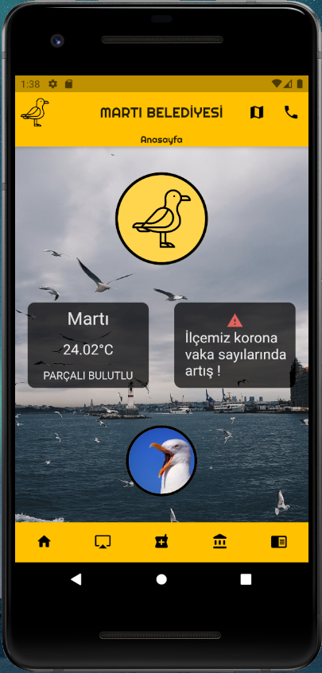
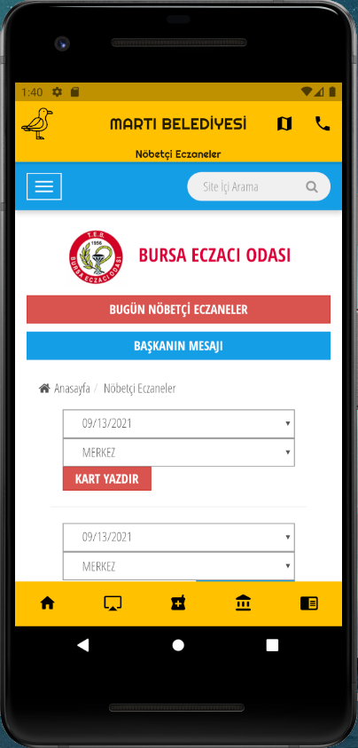

#  Martı Belediyesi

<b>Martı Belediyesi App'i, Flutter ile yapılmış basit bir belediye uygulamasıdır.</b>

## Uygulamanın Amacı
Belediyelerin, vatandaşlara var olan hizmetlerini mobil uygulama aracılığıyla daha kolay ulaştırıp zamandan ve mekandan tasarruf sağlamaktır.

### Anasayfa

   

## Nasıl Kurulur?
👉[APK Dosyası](https://github.com/ahmetmert1/agnocalculator/blob/master/app-release.apk)👈 'na tıklayarak indirimi tamamladıktan sonra telefonunuza kurup uygulamayı kullanabilirsiniz.

 
# 💻 Teknolojiler 
- Dart 
- Flutter 
- VS Code

## Teknik Ayrıntılar

Hava durumu güncel tutulmaktadır. API'den veri çekilmektedir.

[Linkedin](https://www.linkedin.com/in/ahmet-mert-öz)

[E-posta](ahmetmertoz11@gmail.com)
